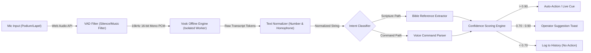

# AI Pipeline & Speech Recognition Architecture
# Sanctuary — AI-Powered Church Presentation & Broadcast System

**Document Version:** 1.0.0  
**Status:** Approved for Implementation  
**STT Engine:** Vosk Offline Speech Recognition (Kaldi Backend)  
**Execution Environment:** Isolated Node.js Worker Thread  
**Privacy & Network:** 100% Offline / Zero Telemetry  

---

## 1. End-to-End AI Audio Pipeline

Sanctuary implements an intelligent, low-latency audio processing pipeline designed specifically for live spoken-word church environments. The pipeline transforms analog microphone input into actionable presentation events in under 1.5 seconds.



---

## 2. Pipeline Stages & Detailed Technical Specifications

### 2.1 Audio Capture & Preprocessing
- **Source:** User-selected audio input device (ASIO, WASAPI, or CoreAudio via Web Audio API).
- **Format:** 16kHz sample rate, 16-bit depth, single channel (Mono) PCM.
- **Buffer Size:** 4096 samples (~256ms chunk) processed via a dedicated `AudioWorkletNode` in the Renderer and transferred to the AI worker over shared ring buffers.

### 2.2 Voice Activity Detection (VAD)
- **Engine:** Energy-based thresholding and WebRTC VAD (operating at Aggressiveness Mode 2).
- **Objective:** Reject background organ/piano music, congregation chatter, and silent pauses before feeding data to the acoustic model, reducing CPU utilization by up to 65%.

### 2.3 Vosk Speech-to-Text Recognizer
- **Model:** Pre-bundled `vosk-model-small-en-us-0.15` (45MB footprint) with support for optional high-accuracy `vosk-model-en-us-0.22` (1.8GB).
- **Acoustic Decoding:** Executes on a separate OS thread in C++ Node bindings (`vosk`), producing partial hypotheses in real time and finalized sentences upon speech pauses.

### 2.4 Text Normalization & Preprocessing
Spoken English frequently presents numbers and biblical titles in non-standard colloquial forms. The normalization engine applies deterministic token transformations:

| Spoken Input | Normalized Token | Transformation Rule |
| :--- | :--- | :--- |
| *"first john three sixteen"* | `1 John 3:16` | Word numbers to cardinal digits + Book prefix mapping |
| *"second corinthians chapter five verse seventeen"* | `2 Corinthians 5:17` | Structural keywords ('chapter', 'verse') parsed to `C:V` |
| *"revelations twenty one"* | `Revelation 21` | Colloquial plural removal (`revelations` -> `Revelation`) |
| *"psalm twenty three verses one to four"* | `Psalms 23:1-4` | Multi-verse range mapping |
| *"song of solomon two four"* | `Song of Solomon 2:4` | Multi-word book title tokenization |

---

## 3. Scripture Reference Extraction Engine

The scripture reference extractor uses a two-pass parser combining a Deterministic Finite Automaton (DFA) state machine with canonical book aliasing.

```typescript
export interface ScriptureReferenceMatch {
  book: string;          // Canonical Book Name (e.g., 'Romans')
  bookNumber: number;    // 1 to 66
  chapter: number;       // e.g., 8
  verseStart: number;    // e.g., 28
  verseEnd?: number;     // e.g., 30 (optional)
  confidence: number;    // 0.00 to 1.00
  rawMatchedText: string;// "romans eight twenty eight"
}
```

### 3.1 Book Alias Resolution Table
The engine maps over 400 colloquial abbreviations and phonetic spellings to the standard 66 canonical books:
- `Gen`, `Genesis`, `Ge` -> Genesis
- `1 Cor`, `First Corinthians`, `1st Corinthians`, `First Cor` -> 1 Corinthians
- `Phil`, `Philippians`, `Philipians` -> Philippians
- `Hab`, `Habakkuk`, `Habakuk` -> Habakkuk

---

## 4. Voice Command Interpreter

When enabled by the operator, pastors or solo operators can execute hands-free presentation navigation through spoken commands:

| Spoken Voice Command | Intent Enum | Action Executed |
| :--- | :--- | :--- |
| *"Next slide"* / *"Advance slide"* | `CMD_NEXT_SLIDE` | Advances to the subsequent slide in active cue |
| *"Previous slide"* / *"Go back"* | `CMD_PREV_SLIDE` | Returns to the previous slide in active cue |
| *"Clear text"* | `CMD_CLEAR_TEXT` | Fades out scripture/lyric text; preserves video background |
| *"Black screen"* / *"Blackout"* | `CMD_BLACKOUT` | Fades all output displays to solid black |
| *"Show chorus"* / *"Go to bridge"* | `CMD_JUMP_SECTION` | Directly jumps to specified song section in active lyric |
| *"Clear all"* / *"Show background"* | `CMD_CLEAR_ALL` | Restores standard background without text |

---

## 5. Confidence Scoring & Decision Matrix

To eliminate accidental slide triggers during normal sermon delivery, Sanctuary utilizes a strict 3-tier confidence threshold system:

```
                  ┌─────────────────────────────────────┐
                  │ Vosk Acoustic Score + Parser Match  │
                  └──────────────────┬──────────────────┘
                                     │
           ┌─────────────────────────┼─────────────────────────┐
           ▼                         ▼                         ▼
   Score ≥ 0.90               0.70 ≤ Score < 0.90         Score < 0.70
┌───────────────────────┐ ┌───────────────────────┐ ┌───────────────────────┐
│     HIGH TIER         │ │     MEDIUM TIER       │ │      LOW TIER         │
│ Auto-Live Mode:       │ │ Operator Suggestion:  │ │ Action:               │
│ - Sets Live or Stages │ │ - Displays Amber Toast│ │ - Ignored completely  │
│ - Instant Hotkey Ready│ │ - Press [Enter] to cue│ │ - Logged to history   │
└───────────────────────┘ └───────────────────────┘ └───────────────────────┘
```

### 5.1 Scoring Calculation Algorithm
```typescript
export function calculateConfidence(
  acousticScore: number,       // 0.0 to 1.0 from Vosk decoder
  bookExactMatch: boolean,      // 1.0 if full book name matched, 0.8 if alias
  hasChapterAndVerse: boolean,  // 1.0 if both present, 0.7 if chapter only
  inContextPrecedingWord: boolean // 1.0 if preceded by "turn to", "read", "bible"
): number {
  let score = acousticScore * 0.4;
  if (bookExactMatch) score += 0.25; else score += 0.15;
  if (hasChapterAndVerse) score += 0.25; else score += 0.10;
  if (inContextPrecedingWord) score += 0.10;
  return Math.min(Math.max(score, 0.0), 1.0);
}
```

---

## 6. Provider Abstraction (`AIProvider` Interface)

To allow seamless swapping between STT engines (e.g., Vosk, Whisper.cpp, or Mock providers during automated testing), the entire AI subsystem adheres to a strict TypeScript contract:

```typescript
export interface AIProviderConfig {
  modelPath: string;
  sampleRate: number;
  enableVAD: boolean;
  confidenceThreshold: number;
}

export interface IAIProvider {
  initialize(config: AIProviderConfig): Promise<void>;
  processAudioChunk(chunk: Int16Array): void;
  onTranscription(callback: (text: string, isFinal: boolean) => void): void;
  onScriptureDetected(callback: (match: ScriptureReferenceMatch) => void): void;
  onVoiceCommand(callback: (command: string, confidence: number) => void): void;
  reset(): void;
  destroy(): Promise<void>;
}
```

---

## 7. Safety Boundaries & Sandboxing Guarantees

1. **Zero OS Command Execution:** The AI engine output is strictly constrained to a finite enum of presentation-specific UI events (`SET_LIVE_SCRIPTURE`, `NEXT_SLIDE`, `CLEAR_SCREEN`). Under no circumstances can the AI engine execute system shell commands, filesystem writes outside logs, or network requests.
2. **Deterministic Precedence (Operator Override):** Physical operator inputs (keyboard spacebar, arrow keys, mouse clicks) immediately supersede and cancel any queued AI suggestions or automated transitions.
3. **Emergency Disarm Switch:** A prominent global toggle (`F8` or UI toggle button) instantly disarms all AI auto-live actions, reverting Sanctuary to 100% manual operator control.
