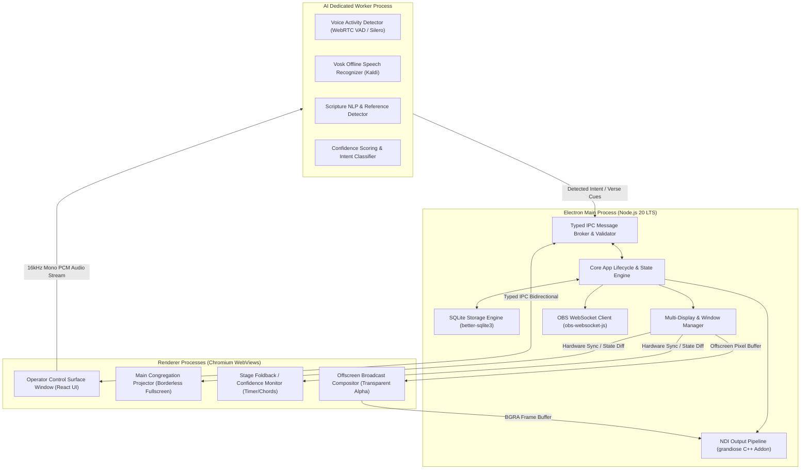

# System Architecture Specification
# Sanctuary — AI-Powered Church Presentation & Broadcast System

**Document Version:** 1.0.0  
**Status:** Approved for Implementation  
**Architecture Pattern:** Modular Multi-Process Electron with Event-Driven IPC & Decoupled Workers  
**Target Platform:** Windows 11 / Cross-Platform Ready  

---

## 1. High-Level Process Architecture

Sanctuary utilizes Electron's multi-process architecture to achieve strict fault isolation, multi-display rendering, and responsive UI performance under heavy AV workloads.



---

## 2. Process Responsibilities & Threading Model

### 2.1 Electron Main Process
- **Lifecycle & Native Integration:** Manages native window creation, OS power-save blocking (`powerSaveBlocker` during active presentation), display monitor topology changes, and global keyboard shortcuts.
- **Data Persistence:** Hosts the `better-sqlite3` embedded SQLite engine. All database transactions, migrations, and FTS5 full-text indexing occur synchronously in Main or dedicated DB worker to avoid main-thread blocking.
- **Broadcast Egress:** Executes native C++ NDI bindings via `grandiose` to stream 60fps BGRA video frames with alpha transparency onto the local network.
- **OBS Automation:** Maintains persistent WebSocket v5 connection to OBS Studio for automated scene and source triggers.

### 2.2 Dedicated AI Worker Process (Forked Node.js Child Process)
- **Isolation Guarantee:** Runs as a separate OS process (`child_process.fork` or Node `WorkerThread`). A crash, CPU spike, or memory leak in the speech recognition model cannot freeze or crash the live presentation window.
- **Vosk STT Execution:** Receives continuous 16kHz 16-bit mono PCM audio packets, performs VAD thresholding, and decodes speech offline.
- **Deterministic Scripture Matching:** Evaluates recognized tokens against a pre-compiled trie and regex state machine of all 66 Biblical books and chapter/verse patterns.

### 2.3 Renderer Processes
- **Operator Control Window (`/operator`):** Full React 18 UI containing service run-lists, Bible browser, lyric editor, audio input selector, and dual preview/program live controls.
- **Main Output Window (`/output/projector`):** Lightweight, GPU-accelerated window targeted to the secondary display. Features hardware CSS transitions, WebGL canvas effects, and zero heavy business logic.
- **Stage Output Window (`/output/stage`):** Displays high-contrast current slide, next slide preview, stage alert overlays, elapsed sermon clock, and service countdown timers.
- **Offscreen NDI Compositor Window (`/output/ndi`):** Rendered offscreen with transparent background for broadcast overlays (lower thirds, scripture subtitles, song title bugs).

---

## 3. Module Boundaries & Directory Architecture

The system enforces clear modular boundaries with unidirectional dependency flow:

```
src/
├── main/                       # Electron Main Process
│   ├── index.ts                # Application Entry Point
│   ├── windows/                # Window lifecycle managers (Operator, Projector, Stage, NDI)
│   ├── ipc/                    # IPC registration, routing, and schema validation
│   ├── database/               # better-sqlite3 connection, schemas, migrations, repositories
│   ├── broadcast/              # NDI (grandiose) and OBS (obs-websocket-js) drivers
│   └── services/               # DisplayManager, PowerManager, HotkeyManager
│
├── ai/                         # Isolated AI Subsystem
│   ├── worker.ts               # Worker thread entry point
│   ├── vad/                    # Voice activity detection filters
│   ├── vosk/                   # Vosk model loader and recognizer wrapper
│   ├── parser/                 # Natural language scripture detection & normalization
│   └── commands/               # Voice navigation command interpreter
│
├── renderer/                   # React Frontend (Vite Bundle)
│   ├── index.html              # Single HTML root routing to views via hash/path
│   ├── main.tsx                # React root mount
│   ├── routes/                 # Operator, Projector, Stage, NDI View roots
│   ├── components/             # Reusable UI Design System components
│   ├── features/               # Domain feature modules
│   │   ├── bible/              # Scripture search, verse picker, multi-translation selector
│   │   ├── lyrics/             # Song library, section sequence editor, chord display
│   │   ├── presentation/       # Preview/Program dual surface, transition controller
│   │   ├── media/              # Background video player, audio cues, image gallery
│   │   ├── service-plan/       # Service order builder, cue timeline, drag-and-drop
│   │   ├── ai-assistant/       # Live transcript monitor, suggestion toasts, mic setup
│   │   └── broadcast/          # NDI lower third designer, OBS scene mapping
│   ├── stores/                 # State management (Zustand / Redux-free lightweight store)
│   └── hooks/                  # AudioWorklet capture hooks, IPC subscription hooks
│
└── shared/                     # Pure TypeScript Contracts (Zero DOM / Zero Node deps)
    ├── types/                  # Data models (Service, Song, Scripture, DisplayState)
    ├── ipc-events.ts           # Type-safe IPC channels and payload interfaces
    ├── constants/              # Default settings, hotkeys, confidence thresholds
    └── utils/                  # Text normalizers, scripture reference formatters
```

---

## 4. Inter-Process Communication (IPC) Protocol

To guarantee type safety, high throughput, and zero runtime crashes due to mismatched event signatures, all IPC communication uses a strongly-typed contract pattern.

### 4.1 IPC Communication Patterns
1. **Request-Response (`ipcRenderer.invoke` / `ipcMain.handle`):** Used for transactional commands (e.g., querying the Bible database, saving a song, connecting to OBS).
2. **State Broadcast (`webContents.send` / `ipcRenderer.on`):** Used for real-time presentation state broadcasts (e.g., Live Slide Changed, Clear Screen, Audio Peak VU Level).
3. **High-Frequency Stream (`SharedArrayBuffer` or IPC Transferable Buffers):** Used for offscreen NDI video frames and microphone audio streams.

### 4.2 Core IPC Channel Contract Matrix

| Channel Name | Flow Direction | Payload Contract | Description |
| :--- | :--- | :--- | :--- |
| `presentation:set-live` | Operator → Main → Outputs | `{ slideId: string, transition: TransitionType, durationMs: number }` | Changes the active live slide on all outputs |
| `presentation:set-preview`| Operator → Main | `{ slideId: string }` | Stages a slide into the operator's preview monitor |
| `presentation:blackout` | Operator/Voice → Main → Outputs| `{ state: boolean }` | Instantly fades outputs to solid black |
| `presentation:clear-text`| Operator/Voice → Main → Outputs| `{ state: boolean }` | Hides text layer while maintaining background video loop |
| `bible:search-reference`| Operator/AI → Main → DB | `{ query: string, translation: string }` | Returns verses matching book/chapter/verse query |
| `bible:search-text` | Operator → Main → DB | `{ term: string, translation: string, limit: number }` | Executes FTS5 search across biblical text |
| `ai:transcript-chunk` | AI Worker → Main → Operator | `{ text: string, isFinal: boolean, timestamp: number }` | Emits live sermon transcription string |
| `ai:detected-verse` | AI Worker → Main → Operator | `{ reference: string, confidence: number, text: string }` | Emits detected scripture reference with confidence |
| `broadcast:obs-scene` | Main ↔ OBS WebSocket | `{ sceneName: string }` | Triggers automated OBS scene change |
| `display:configure` | Operator → Main | `{ displayId: string, role: 'projector'|'stage'|'ndi' }` | Maps display outputs to physical monitors |

---

## 5. End-to-End Data Flow Diagrams

### 5.1 Presentation Execution Data Flow
```
[User Click / Hotkey Space] 
       │
       ▼
[Operator UI (React Component)]
       │ (Calls usePresentationStore.nextSlide())
       ▼
[IPC Client: 'presentation:set-live']
       │
       ▼
[Main Process IPC Router & Validator]
       │
       ├───────────────────────────────┬───────────────────────────────┐
       ▼                               ▼                               ▼
[Projector Window WebContents]  [Stage Window WebContents]   [NDI Offscreen Window WebContents]
       │ (CSS 3D / WebGL)              │ (Timer / Preview)             │ (Transparent Alpha)
       ▼                               ▼                               ▼
[Secondary HDMI Display (60FPS)] [Stage TV Display]         [NDI Network Stream via grandiose]
```

### 5.2 Offline AI Audio-to-Scripture Data Flow
```
[Preacher Lapel Microphone]
       │
       ▼
[Web Audio API (AudioWorklet)] ──> [Downsample to 16kHz 16-bit Mono PCM]
                                                    │ (Direct IPC Worker Stream)
                                                    ▼
                                     [Dedicated AI Worker Process]
                                                    │
                                                    ├─> [VAD Filter: Silence/Noise Removal]
                                                    │
                                                    ├─> [Vosk Offline Recognizer Engine]
                                                    │     └── Emits: "turn to Romans chapter eight verse twenty-eight"
                                                    │
                                                    ├─> [NLP Scripture Reference Normalizer]
                                                    │     └── Resolves: "Romans 8:28"
                                                    │
                                                    └─> [Confidence Evaluation Engine]
                                                                    │
                                    ┌───────────────────────────────┴───────────────────────────────┐
                                    ▼                                                               ▼
                     Confidence ≥ 0.90 (Auto-Live Mode)                             Confidence 0.70 - 0.90 (Suggestion)
                                    │                                                               │
                                    ▼                                                               ▼
                     [Main: Set Live Slide Instantly]                               [Operator UI: 1-Click Cue Toast]
                                    │                                                               │
                                    ▼                                                               ▼
                     [Projected to Sanctuary Screen]                                [Operator Presses [Enter] to Project]
```

---

## 6. Dependency Injection & Service Decoupling

To allow robust unit testing and simulated hardware execution without physical NDI hardware or multi-monitors, Sanctuary uses an inversion-of-control (IoC) Service Container pattern in the Main process:

```typescript
// Core Service Contracts
export interface IBroadcastService {
  initialize(): Promise<void>;
  sendFrame(buffer: Buffer, width: number, height: number): void;
  destroy(): Promise<void>;
}

export interface IDatabaseService {
  query<T>(sql: string, params?: unknown[]): T[];
  execute(sql: string, params?: unknown[]): void;
  transaction<T>(fn: () => T): T;
}

export interface IAIProvider {
  startListening(audioStream: NodeJS.ReadableStream): void;
  onTranscription(callback: (text: string) => void): void;
  onReferenceDetected(callback: (cue: ScriptureCue) => void): void;
  stopListening(): void;
}
```

In production, `NDIBroadcastService` (wrapping `grandiose`) and `VoskAIProvider` are injected. In CI/CD or development environments, `MockBroadcastService` and `MockAIProvider` can be swapped via configuration flags with zero modifications to presentation business logic.

---

## 7. Error Isolation & Fault-Tolerant Resilience

A catastrophic failure during a live church service is unacceptable. Sanctuary implements defense-in-depth error containment:

1. **AI Subsystem Isolation:**
   - The AI worker process runs with independent memory limits.
   - If the speech recognition model encounters an out-of-memory or C++ fatal error, the main process catches the `worker.on('exit')` event, logs the diagnostic, and restarts the worker in the background after 3 seconds.
   - The active presentation, lyrics, Bible search, and video playback remain 100% operational with zero UI stutter.
2. **Display Window Recovery:**
   - If an external HDMI cable is unplugged or a display driver resets, Electron's `screen.on('display-removed')` / `screen.on('display-added')` handlers automatically pause and re-attach presentation windows without restarting the application.
3. **Database Integrity & WAL Locking:**
   - SQLite operates in Write-Ahead Logging (`WAL`) mode with `NORMAL` synchronous flags, guaranteeing zero database corruption even during sudden power outages in church auditoriums.
4. **Unhandled Exception Guard:**
   - Global uncaught exception and unhandled rejection handlers in Main and Renderer processes trap unexpected UI errors, prevent white-screen crashes, and display non-blocking recovery toasts.
