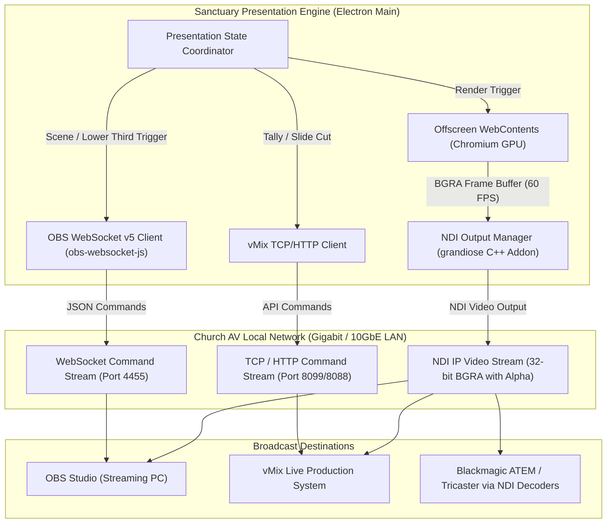

# Broadcast & Video Production Architecture
# Sanctuary — AI-Powered Church Presentation & Broadcast System

**Document Version:** 1.0.0  
**Status:** Approved for Implementation  
**Broadcast Protocols:** NewTek NDI® 5/6, OBS Studio WebSocket v5, vMix TCP/HTTP API  
**Video Pipeline:** Multi-Window Offscreen Chromium WebContents to 32-bit BGRA with Alpha  

---

## 1. High-Level Broadcast Topology

Sanctuary serves as the visual master and broadcast graphics generator for church live streaming and video production setups. It simultaneously drives in-house projectors and broadcast outputs over low-latency IP protocols.



---

## 2. Multi-Output Architecture & Routing Matrix

Sanctuary can generate multiple independent broadcast outputs concurrently without stalling the in-house congregation presentation:

| Output Channel | Protocol | Format | Color Space | Intended Destination |
| :--- | :--- | :--- | :--- | :--- |
| **Program Live** | NDI / HDMI | 1080p60 / 1080p30 | 24-bit RGB | Main Sanctuary Projector & Full-Screen Stream Scene |
| **Lower Thirds** | NDI | 1080p60 / 1080p30 | 32-bit BGRA (with Alpha) | OBS / vMix Overlay (Scripture, Speaker Names, Tickers) |
| **Worship Lyrics** | NDI | 1080p60 / 1080p30 | 32-bit BGRA (with Alpha) | Broadcast Lower Third for Song Lyrics with transparent background |
| **Stage Foldback** | HDMI / NDI | 1080p60 | 24-bit RGB | Preacher Confidence TV / Worship Band Foldback |
| **Preview Staging**| NDI / UI | 1080p30 | 24-bit RGB | Video Director multiviewer or secondary operator station |

---

## 3. Frame Rendering Pipeline & 32-Bit Alpha Compositing

To achieve broadcast-quality lower thirds and lyric overlays, Sanctuary utilizes offscreen Chromium WebContents configured with transparent backgrounds:

```
[React Lower-Third Component (DOM/CSS Transitions)]
                     │
                     ▼
[Chromium Offscreen Window (webPreferences.offscreen = true, transparent = true)]
                     │
                     ▼
[Native GPU Paint Event: 'paint' (Buffer: UInt8ClampedArray)]
                     │
                     ▼
[Format Check: 32-bit BGRA (B, G, R, A) with Premultiplied Alpha]
                     │
                     ▼
[Zero-Copy Shared Memory Transfer to grandiose C++ Native Binding]
                     │
                     ▼
[NewTek NDI SDK: NDIlib_send_send_video_v2()]
                     │
                     ▼
[Network Card Egress (Gigabit Ethernet mDNS / NDI Stream)]
```

### 3.1 Frame Capture Implementation in Electron Main Process
```typescript
import { BrowserWindow } from 'electron';
import grandiose from 'grandiose';

export class BroadcastRenderer {
  private window: BrowserWindow;
  private sender: any;

  public async initialize(sourceName: string, width = 1920, height = 1080): Promise<void> {
    // 1. Initialize NDI native sender via grandiose
    this.sender = await grandiose.send({
      name: sourceName,
      clock_video: true,
      clock_audio: false
    });

    // 2. Create offscreen transparent BrowserWindow
    this.window = new BrowserWindow({
      width,
      height,
      show: false,
      frame: false,
      transparent: true,
      webPreferences: {
        offscreen: true,
        nodeIntegration: false,
        contextIsolation: true
      }
    });

    // 3. Hook into native Chromium paint buffer stream
    this.window.webContents.on('paint', (event, dirty, image) => {
      const bitmap = image.getBitmap(); // Native BGRA 32-bit buffer with 8-bit Alpha
      this.sender.video({
        xres: width,
        yres: height,
        frame_rate_N: 60000,
        frame_rate_D: 1000,
        picture_aspect_ratio: 16 / 9,
        frame_format_type: grandiose.FRAME_FORMAT_TYPE_PROGRESSIVE,
        fourCC: grandiose.FOURCC_BGRA,
        data: bitmap
      });
    });

    await this.window.loadURL('http://localhost:5173/#/output/lower-third');
  }
}
```

---

## 4. OBS Studio Integration (`obs-websocket-js`)

Sanctuary provides native bi-directional integration with OBS Studio 28+ via WebSocket v5 protocol:

### 4.1 Automated Workflow Scenarios
1. **Scene Synchronization:**
   - When Scripture is projected -> Automatically switch OBS to the "Sermon Wide" scene.
   - When a Worship Song is taken live -> Automatically switch OBS to the "Worship Band" scene.
   - When a Video Announcement plays -> Automatically switch OBS to the "Media Playback" scene with audio unmuted.
2. **Lower Third Overlay Toggling:**
   - When a speaker lower third is activated in Sanctuary -> Automatically toggle visibility of the Sanctuary NDI source in OBS.
3. **Stream Health Monitoring:**
   - Real-time display of OBS stream status (Streaming, Recording, Dropped Frames, CPU Usage) directly in the Sanctuary operator status bar.

### 4.2 Connection & Authentication Lifecycle
```typescript
import OBSWebSocket from 'obs-websocket-js';

export class OBSIntegrationService {
  private obs = new OBSWebSocket();
  private isConnected = false;

  public async connect(url: string, password?: string): Promise<boolean> {
    try {
      await this.obs.connect(url, password, {
        eventSubscriptions: 0x00000001 | 0x00000004 // General & Scenes
      });
      this.isConnected = true;
      console.log('OBS WebSocket v5 connected successfully');
      return true;
    } catch (err) {
      console.warn('OBS connection failed (optional broadcast feature):', err);
      this.isConnected = false;
      return false;
    }
  }

  public async switchScene(sceneName: string): Promise<void> {
    if (!this.isConnected) return;
    try {
      await this.obs.call('SetCurrentProgramScene', { sceneName });
    } catch (err) {
      console.error(`Failed to switch OBS scene to "${sceneName}":`, err);
    }
  }

  public async toggleSourceVisibility(sceneName: string, sceneItemId: number, enabled: boolean): Promise<void> {
    if (!this.isConnected) return;
    try {
      await this.obs.call('SetSceneItemEnabled', { sceneName, sceneItemId, sceneItemEnabled: enabled });
    } catch (err) {
      console.error('Failed to toggle OBS source visibility:', err);
    }
  }
}
```

---

## 5. vMix Live Production Integration (TCP / HTTP API)

For churches running vMix 4K/Pro, Sanctuary interfaces via the low-latency vMix TCP API (Port 8099) and HTTP API (Port 8088):

### 5.1 Supported vMix Control Operations
- **API Function Calls:** `FUNCTION Cut`, `FUNCTION Fade Duration=500`, `FUNCTION OverlayInput1In Input=Sanctuary-NDI`.
- **Dynamic Text Title Injection:** Update vMix XAML Title inputs dynamically with preacher names or sermon points using `FUNCTION SetText Input=Title1&SelectedName=Headline&Value=Romans 8:28`.
- **Tally Feedback:** Listen to vMix tally feedback (`TALLY OK 1201...`) to indicate live broadcast camera tally on the Sanctuary Stage Confidence Monitor.

---

## 6. Resolution, Framerate & Performance Throttling

To ensure stable performance across varying hardware profiles (from integrated Intel GPUs to dedicated NVIDIA RTX workstations), the broadcast pipeline supports configurable quality tiers:

| Performance Profile | Resolution | Framerate | Color Format | Target Hardware |
| :--- | :--- | :--- | :--- | :--- |
| **Broadcast Ultra** | 3840 x 2160 (4K) | 60 FPS | 32-bit BGRA | Dedicated GPU (NVIDIA RTX 3060+, Apple M-series) |
| **Broadcast High (Default)**| 1920 x 1080 (1080p)| 60 FPS | 32-bit BGRA | Mid-range GPU (NVIDIA GTX 1650+ / Modern Iris Xe) |
| **Broadcast Standard** | 1920 x 1080 (1080p)| 30 FPS | 32-bit BGRA | Integrated GPU (Intel UHD 620/630, AMD Ryzen Vega) |
| **Broadcast Low-Bandwidth**| 1280 x 720 (720p) | 30 FPS | 24-bit RGB | Legacy hardware or congested 100Mbps Ethernet LANs |

---

## 7. Strict Failure Isolation Strategy

Broadcast protocols (NDI network drops, OBS crashes, vMix socket timeouts) are strictly decoupled from the core presentation engine:

1. **Non-Blocking Architecture:** All network calls to OBS and vMix execute asynchronously with strict 1500ms timeouts. If OBS hangs, slide transitions on the main projector execute with zero delay.
2. **NDI Sender Recovery:** If the network card disconnects or NDI fails, the NDI sender enters an automatic backoff retry loop (retrying every 5 seconds) while local display windows continue rendering without interruption.
3. **Zero Main Process Crashes:** Native C++ exceptions from `grandiose` are trapped within wrapped C++ try/catch boundaries, preventing segmentation faults from crashing the Electron main process.
