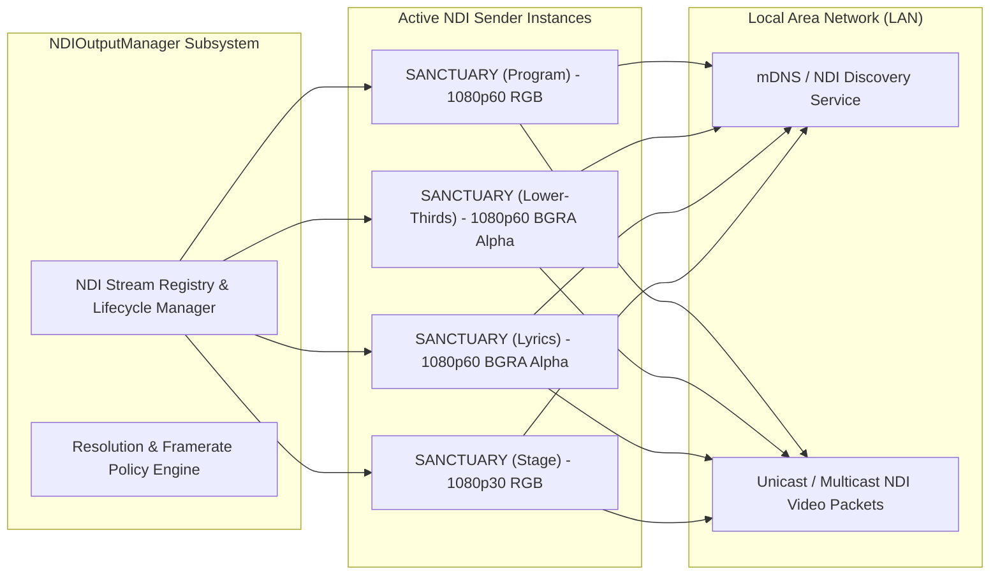

# NDI® Output Engine Architecture & Implementation
# Sanctuary — AI-Powered Church Presentation & Broadcast System

**Document Version:** 1.0.0  
**Status:** Approved for Implementation  
**NDI SDK Version:** NewTek NDI® 5.5 / 6.0  
**Node.js Binding:** `grandiose` (Native C++ N-API Wrapper)  
**Encoding Format:** 32-bit BGRA (Progressive) with 8-bit Alpha Channel  

---

## 1. NDI Output Subsystem Overview

Network Device Interface (NDI®) is the broadcast industry standard for transmitting ultra-low latency, high-definition video over standard Gigabit IP networks. Sanctuary integrates a dedicated NDI engine capable of originating multiple simultaneous broadcast feeds with transparent alpha overlays directly into video switchers (OBS Studio, vMix, Tricaster, Wirecast, ATEM via NDI-to-HDMI converters).



---

## 2. `NDIOutputManager` Class Architecture

The `NDIOutputManager` is a singleton service residing in Electron's Main process responsible for managing the full lifecycle of all NDI sender instances.

### 2.1 Core TypeScript Interfaces
```typescript
export interface NDISourceConfig {
  id: string;                         // UUID v4
  channelName: string;                // e.g., 'SANCTUARY-LOWER-THIRDS'
  targetRoute: 'program' | 'lower-third' | 'lyrics' | 'stage' | 'preview';
  width: number;                      // 1920 or 3840
  height: number;                     // 1080 or 2160
  frameRateNumerator: number;         // 60000 or 30000
  frameRateDenominator: number;       // 1000
  hasAlpha: boolean;                  // true for BGRA transparent overlays
  ndiGroup?: string;                  // Optional NDI group name (e.g., 'CHURCH-AV')
  isEnabled: boolean;
}

export interface INDISenderInstance {
  config: NDISourceConfig;
  senderHandle: any;                  // grandiose native sender reference
  offscreenWindow: Electron.BrowserWindow | null;
  frameCount: number;
  droppedFrames: number;
  lastFrameTimestamp: number;
}
```

### 2.2 `NDIOutputManager` Implementation
```typescript
import { BrowserWindow } from 'electron';
import grandiose from 'grandiose';
import path from 'path';

export class NDIOutputManager {
  private static instance: NDIOutputManager;
  private senders: Map<string, INDISenderInstance> = new Map();

  private constructor() {}

  public static getInstance(): NDIOutputManager {
    if (!NDIOutputManager.instance) {
      NDIOutputManager.instance = new NDIOutputManager();
    }
    return NDIOutputManager.instance;
  }

  public async registerOutput(config: NDISourceConfig): Promise<void> {
    if (this.senders.has(config.id)) {
      await this.destroyOutput(config.id);
    }

    if (!config.isEnabled) {
      this.senders.set(config.id, {
        config,
        senderHandle: null,
        offscreenWindow: null,
        frameCount: 0,
        droppedFrames: 0,
        lastFrameTimestamp: 0
      });
      return;
    }

    try {
      // 1. Create native NDI sender
      const senderHandle = await grandiose.send({
        name: config.channelName,
        clock_video: true,
        clock_audio: false,
        groups: config.ndiGroup ? [config.ndiGroup] : undefined
      });

      // 2. Create offscreen transparent BrowserWindow for GPU rendering
      const offscreenWindow = new BrowserWindow({
        width: config.width,
        height: config.height,
        show: false,
        frame: false,
        transparent: config.hasAlpha,
        webPreferences: {
          offscreen: true,
          nodeIntegration: false,
          contextIsolation: true,
          preload: path.join(__dirname, '../preload/index.js')
        }
      });

      const senderInstance: INDISenderInstance = {
        config,
        senderHandle,
        offscreenWindow,
        frameCount: 0,
        droppedFrames: 0,
        lastFrameTimestamp: Date.now()
      };

      // 3. Register paint buffer handler
      offscreenWindow.webContents.on('paint', (event, dirty, image) => {
        if (!senderInstance.senderHandle) return;

        const bitmapBuffer = image.getBitmap(); // 32-bit BGRA buffer
        senderInstance.senderHandle.video({
          xres: config.width,
          yres: config.height,
          frame_rate_N: config.frameRateNumerator,
          frame_rate_D: config.frameRateDenominator,
          picture_aspect_ratio: 16 / 9,
          frame_format_type: grandiose.FRAME_FORMAT_TYPE_PROGRESSIVE,
          fourCC: config.hasAlpha ? grandiose.FOURCC_BGRA : grandiose.FOURCC_BGRX,
          data: bitmapBuffer
        });

        senderInstance.frameCount++;
        senderInstance.lastFrameTimestamp = Date.now();
      });

      // 4. Load corresponding React renderer route
      await offscreenWindow.loadURL(`http://localhost:5173/#/output/${config.targetRoute}`);

      this.senders.set(config.id, senderInstance);
      console.log(`[NDI] Output "${config.channelName}" successfully initialized at ${config.width}x${config.height}@${config.frameRateNumerator/config.frameRateDenominator}fps`);
    } catch (err) {
      console.error(`[NDI] Failed to initialize output "${config.channelName}":`, err);
    }
  }

  public async setOutputEnabled(id: string, enabled: boolean): Promise<void> {
    const instance = this.senders.get(id);
    if (!instance) return;
    instance.config.isEnabled = enabled;
    await this.registerOutput(instance.config);
  }

  public async destroyOutput(id: string): Promise<void> {
    const instance = this.senders.get(id);
    if (!instance) return;

    if (instance.offscreenWindow && !instance.offscreenWindow.isDestroyed()) {
      instance.offscreenWindow.destroy();
    }
    if (instance.senderHandle) {
      try {
        await instance.senderHandle.destroy();
      } catch (err) {
        console.warn(`[NDI] Error destroying sender handle ${id}:`, err);
      }
    }
    this.senders.delete(id);
  }

  public async destroyAll(): Promise<void> {
    for (const id of Array.from(this.senders.keys())) {
      await this.destroyOutput(id);
    }
  }
}
```

---

## 3. Output Channels & Naming Conventions

To maintain order in complex church broadcast networks with multiple video switchers and remote cameras, Sanctuary enforces clear, predictable NDI channel naming:

```
[HOST_NAME] / [APP_PREFIX] - [CHANNEL_PURPOSE]
Example: SANCTUARY-PC / SANCTUARY - LOWER-THIRDS
```

### 3.1 Standard Channel Catalog
1. `SANCTUARY - PROGRAM`: Primary program feed showing background video, full slide lyrics, scriptures, and announcements.
2. `SANCTUARY - LOWER-THIRDS`: Dedicated transparent feed containing speaker names, scripture subtitles, and sermon bullet points with 32-bit alpha transparency.
3. `SANCTUARY - LYRICS`: Transparent lower-third worship lyric feed formatted specifically for live video streaming (2-line layout).
4. `SANCTUARY - STAGE`: Confidence monitor feed rendering speaker clock, next slide preview, and band cues.

---

## 4. Performance Optimization for Integrated GPUs

Many church presentation PCs utilize integrated Intel GPUs (e.g., Intel UHD 620/630 or Iris Xe) without dedicated graphics cards. Sanctuary employs four key optimizations to ensure 60fps NDI streaming without CPU thermal throttling:

1. **Dirty Rect Throttling & On-Demand Painting:**
   Chromium only triggers the `paint` event when the visual DOM actually updates (e.g., slide transitions, timer ticks). When slides are static, zero frame capture or memory copies occur, dropping CPU load to near 0%.
2. **Zero-Copy Memory Passing:**
   The `image.getBitmap()` buffer is passed directly to the `grandiose` C++ native addon without intermediate JavaScript string conversions or array allocations.
3. **Adaptive Framerate Policy:**
   - Program & Lower Thirds: 1080p at 60 FPS (fluid transitions).
   - Stage & Confidence Monitors: 1080p at 30 FPS (conserves 50% CPU/GPU bandwidth).
4. **Resolution Downsampling Option:**
   For low-spec systems running 3+ simultaneous NDI feeds, operators can select 720p60 broadcast output mode, reducing memory bandwidth requirements by 55%.

---

## 5. Network Discovery & mDNS Configuration

- **Discovery Protocol:** Uses mDNS / Bonjour automatic multicast discovery (standard NDI port 5353) allowing OBS Studio and vMix to auto-detect Sanctuary NDI sources without typing IP addresses.
- **NDI Discovery Server Support:** For enterprise multi-subnet church campus networks where multicast mDNS is disabled across VLANs, Sanctuary supports pointing to a central NDI Discovery Server IP address via application settings.
