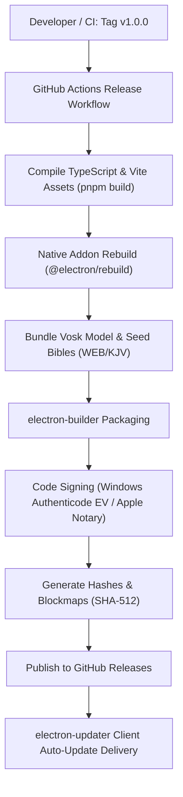

# Release Engineering & Deployment Process
# Sanctuary — AI-Powered Church Presentation & Broadcast System

**Document Version:** 1.0.0  
**Packaging Engine:** `electron-builder`  
**Distribution Target:** Windows 11 (NSIS Installer & Portable ZIP), macOS (DMG / Universal), Linux (AppImage)  
**Auto-Update Mechanism:** `electron-updater` via GitHub Releases / HTTPS S3 Mirror  

---

## 1. Release Architecture & Tooling

Sanctuary produces cryptographically signed, production-ready desktop installers for church production workstations.



---

## 2. `electron-builder` Configuration Specification

The build configuration is maintained in `electron-builder.json5`:

```json5
{
  "appId": "com.sanctuary.app",
  "productName": "Sanctuary",
  "copyright": "Copyright © 2026 Sanctuary Open AV Project",
  "directories": {
    "output": "release/${version}",
    "buildResources": "resources"
  },
  "files": [
    "dist/**/*",
    "resources/models/**/*",
    "resources/bibles/**/*",
    "package.json"
  ],
  "extraResources": [
    {
      "from": "resources/models",
      "to": "models",
      "filter": ["**/*"]
    },
    {
      "from": "resources/bibles",
      "to": "bibles",
      "filter": ["**/*"]
    }
  ],
  "win": {
    "target": [
      {
        "target": "nsis",
        "arch": ["x64"]
      },
      {
        "target": "zip",
        "arch": ["x64"]
      }
    ],
    "icon": "resources/icons/icon.ico",
    "signingHashAlgorithms": ["sha256"],
    "certificateFile": "${env.WIN_CSC_LINK}",
    "certificatePassword": "${env.WIN_CSC_KEY_PASSWORD}"
  },
  "nsis": {
    "oneClick": false,
    "allowToChangeInstallationDirectory": true,
    "createDesktopShortcut": true,
    "createStartMenuShortcut": true,
    "shortcutName": "Sanctuary Presentation",
    "installerIcon": "resources/icons/installer.ico",
    "uninstallerIcon": "resources/icons/uninstaller.ico"
  },
  "mac": {
    "target": ["dmg", "zip"],
    "category": "public.app-category.video",
    "icon": "resources/icons/icon.icns",
    "hardenedRuntime": true,
    "gatekeeperAssess": false,
    "entitlements": "resources/entitlements.mac.plist",
    "entitlementsInherit": "resources/entitlements.mac.plist"
  },
  "publish": {
    "provider": "github",
    "owner": "sanctuary-app",
    "repo": "sanctuary",
    "releaseType": "release"
  }
}
```

---

## 3. Code Signing & Certification Guidelines

To prevent Windows SmartScreen warnings and macOS Gatekeeper blocks on church workstations, all production binaries must undergo cryptographic signing:

### 3.1 Windows Signing (Authenticode EV)
- **Requirements:** Extended Validation (EV) Code Signing Certificate (Hardware USB Token or Azure Key Vault Cloud HSM).
- **Environment Variables:**
  - `WIN_CSC_LINK`: Path to base64 certificate bundle or Azure Key Vault endpoint.
  - `WIN_CSC_KEY_PASSWORD`: Password for hardware/cloud certificate.
- **Verification Command:**
  ```powershell
  Get-AuthenticodeSignature -FilePath "release\1.0.0\Sanctuary Setup 1.0.0.exe"
  ```

### 3.2 macOS Code Signing & Notarization
- **Requirements:** Apple Developer ID Application Certificate + App Store Connect API Key for automated notarization.
- **Environment Variables:**
  - `APPLE_ID`: Developer Apple ID email.
  - `APPLE_APP_SPECIFIC_PASSWORD`: App-specific password.
  - `APPLE_TEAM_ID`: 10-character Apple Developer Team ID.

---

## 4. Semantic Versioning & Release Workflow

We adhere to strict Semantic Versioning (`MAJOR.MINOR.PATCH`):
- **MAJOR (`1.0.0` -> `2.0.0`):** Breaking changes to the SQLite database schema requiring manual migration, or major UI overhauls.
- **MINOR (`1.0.0` -> `1.1.0`):** New features (e.g., adding vMix integration, new Bible format import).
- **PATCH (`1.0.0` -> `1.0.1`):** Bug fixes, performance optimizations, or UI polish.

### 4.1 Step-by-Step Release Protocol

1. **Pre-Release Code Freeze & Branching:**
   ```bash
   git checkout develop
   git pull origin develop
   git checkout -b release/v1.0.0
   ```

2. **Automated Test & Audit Gate:**
   ```bash
   pnpm lint
   pnpm test:coverage
   pnpm test:e2e
   pnpm audit --prod
   ```

3. **Version Bump & Changelog Generation:**
   ```bash
   # Bumps package.json and generates git tag
   pnpm version minor
   pnpm changelog
   ```

4. **Trigger Build & Release via GitHub Actions:**
   ```bash
   git push origin release/v1.0.0 --follow-tags
   # Create and merge PR into main
   ```

---

## 5. In-App Auto-Update Delivery (`electron-updater`)

Sanctuary checks for updates silently upon launch without interrupting live presentations:

```typescript
import { autoUpdater } from 'electron-updater';
import { BrowserWindow } from 'electron';

export class UpdateService {
  public static init(mainWindow: BrowserWindow): void {
    autoUpdater.autoDownload = false; // Never auto-download during a live service
    autoUpdater.autoInstallOnAppQuit = true;

    autoUpdater.on('update-available', (info) => {
      mainWindow.webContents.send('update:available', {
        version: info.version,
        releaseDate: info.releaseDate,
        notes: info.releaseNotes
      });
    });

    // Check on startup if internet is available
    autoUpdater.checkForUpdatesAndNotify().catch((err) => {
      console.log('[Updater] Offline or update check failed:', err.message);
    });
  }
}
```

---

## 6. Pre-Release Verification Checklist

Before publishing any public release tag, the QA lead must verify:

- [ ] All 16 SQLite database migrations execute cleanly on clean install and upgrade paths.
- [ ] World English Bible (WEB) and King James Version (KJV) databases are intact and queryable.
- [ ] Offline Vosk speech recognition successfully transcribes speech without network access.
- [ ] NDI output displays 32-bit transparent alpha channel in OBS Studio without edge artifacts.
- [ ] Dual-monitor borderless projector launch correctly identifies secondary display EDIDs.
- [ ] Windows 11 SmartScreen displays verified publisher name with zero security warnings.
- [ ] Sentry / Crash reporter debug symbols are generated and archived.
