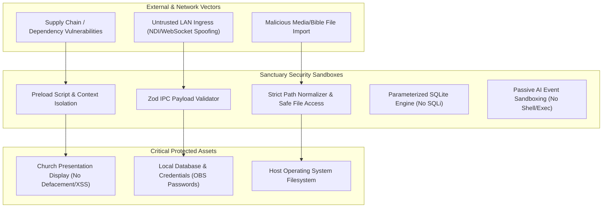

# Security Architecture & Threat Mitigation Specification
# Sanctuary — AI-Powered Church Presentation & Broadcast System

**Document Version:** 1.0.0  
**Status:** Approved Security Baseline  
**Target Environment:** Local Desktop Workstation & Church Production LAN  

---

## 1. Threat Model & Risk Surface Analysis

Church presentation systems operate in hybrid production environments where operator laptops connect to local church LANs, live streaming video mixers (OBS), projection displays, and USB storage devices.



### 1.1 Threat Assessment Matrix

| Threat Vector | Potential Impact | Severity | Mitigation Strategy |
| :--- | :--- | :--- | :--- |
| **Malicious Media Import** | Path traversal, arbitrary file write | HIGH | Strict path canonicalization, whitelist of media MIME types |
| **Renderer Process Compromise**| Host OS file/process compromise | CRITICAL | Context Isolation enabled, Node Integration disabled, minimal Preload API |
| **SQL Injection (SQLi)** | Database tampering, data loss | HIGH | 100% parameterized queries via `better-sqlite3` prepared statements |
| **AI Command Injection** | Unauthorized slide jumping or OS command execution | HIGH | Passive classification only; deterministic enum whitelist; zero `eval`/`exec` |
| **OBS Credential Interception**| Unauthorized stream control | MEDIUM | SHA-256 challenge-response auth, encrypted local credential store |
| **Malicious Auto-Update** | Remote code execution on boot | CRITICAL | Cryptographic binary code signing, SHA-256 checksum verification |

---

## 2. Electron Process Sandboxing & IPC Security

Sanctuary adheres to Electron’s official security best practices to ensure complete isolation between web renderers and the host operating system.

### 2.1 Window Security Configuration
All `BrowserWindow` instances enforce strict security flags:

```typescript
const windowConfig: Electron.BrowserWindowConstructorOptions = {
  webPreferences: {
    // 1. Prevent renderer from accessing Node.js runtime directly
    nodeIntegration: false,
    nodeIntegrationInWorker: false,
    nodeIntegrationInSubFrames: false,
    
    // 2. Enforce context isolation between internal Electron scripts and website DOM
    contextIsolation: true,
    
    // 3. Disable dynamic remote module execution
    sandbox: true,
    
    // 4. Block loading of insecure HTTP content within the application
    allowRunningInsecureContent: false,
    
    // 5. Preload script with minimal typed surface
    preload: path.join(__dirname, '../preload/index.js'),
    
    // 6. Disable webview tags to avoid nested unvetted rendering
    webviewTag: false
  }
};
```

### 2.2 Strict Context Bridge API
The Preload script exposes only a curated set of deterministic methods via `contextBridge.exposeInMainWorld`:

```typescript
// preload.ts
import { contextBridge, ipcRenderer } from 'electron';

contextBridge.exposeInMainWorld('sanctuaryAPI', {
  sendPresentationCommand: (command: PresentationCommand) => {
    ipcRenderer.invoke('presentation:command', command);
  },
  onLiveSlideChanged: (callback: (slide: SlideData) => void) => {
    const listener = (_: unknown, data: SlideData) => callback(data);
    ipcRenderer.on('presentation:live-updated', listener);
    return () => ipcRenderer.removeListener('presentation:live-updated', listener);
  }
});
```

### 2.3 IPC Runtime Schema Validation (Zod)
Every IPC handler in the Main process validates input payloads at runtime using `zod` schemas before executing business logic:

```typescript
import { z } from 'zod';

const SetLiveSlideSchema = z.object({
  slideId: z.string().uuid(),
  transition: z.enum(['cut', 'fade', 'slide-left', 'zoom']),
  durationMs: z.number().min(0).max(5000)
});

ipcMain.handle('presentation:set-live', async (_, payload) => {
  const parsed = SetLiveSlideSchema.safeParse(payload);
  if (!parsed.success) {
    console.error('Invalid IPC payload rejected:', parsed.error);
    throw new Error('SECURITY_ERROR: Malformed IPC Payload');
  }
  return presentationService.setLive(parsed.data);
});
```

---

## 3. Filesystem Security & Path Traversal Prevention

When church operators import media files, custom backgrounds, or external Bible databases, Sanctuary prevents directory traversal attacks (`../` escaping) using strict path normalization:

```typescript
import path from 'path';
import fs from 'fs';

export function getSafeMediaDestination(userSuppliedFilename: string, appDataMediaDir: string): string {
  // 1. Strip relative navigation and dangerous characters
  const sanitizedFilename = path.basename(userSuppliedFilename).replace(/[^a-zA-Z0-9._-]/g, '_');
  
  // 2. Resolve target absolute path
  const targetPath = path.resolve(appDataMediaDir, sanitizedFilename);
  
  // 3. Verify that the target path is strictly within the allowed media directory
  if (!targetPath.startsWith(path.resolve(appDataMediaDir))) {
    throw new Error('SECURITY_VIOLATION: Path traversal attempt detected');
  }
  
  return targetPath;
}
```

---

## 4. AI Engine Sandboxing & Passive Output Constraints

The AI subsystem (Vosk speech-to-text and scripture parsing) is treated as an untrusted input parser.

1. **No System Execution Primitives:** The AI worker code has zero access to Node’s `child_process.exec`, `fs.writeFile` (outside structured append-only log files), or network sockets.
2. **Deterministic Domain Actions:** The AI engine can only emit strongly typed enum values:
   ```typescript
   export type AllowedAIAction = 
     | { type: 'SUGGEST_SCRIPTURE'; book: string; chapter: number; verse: number; confidence: number }
     | { type: 'TRIGGER_VOICE_COMMAND'; command: 'NEXT' | 'PREV' | 'CLEAR' | 'BLACKOUT' };
   ```
3. **Fail-Safe Disarm:** A physical killswitch in the operator UI immediately terminates the audio capture pipeline, disconnecting the microphone from the AI worker.

---

## 5. Network & Broadcast Security

1. **OBS WebSocket Authentication:** All connections to OBS Studio require SHA-256 password challenge-response authentication (RFC 7616 standard). Plaintext passwords are never transmitted across the local network.
2. **NDI LAN Isolation:** NDI video streams are bound exclusively to the designated church AV production subnet. NDI Access Manager grouping is supported to isolate church broadcast feeds from public or guest Wi-Fi networks.
3. **No Inbound Open Ports:** Sanctuary acts purely as an NDI sender and WebSocket client; it opens zero listening HTTP/TCP server ports on the host workstation.

---

## 6. Secure Update Mechanism & Code Signing

1. **Cryptographic Code Signing:**
   - **Windows:** Production installers (`.exe`, `.msi`) are signed with an EV Code Signing Certificate using Microsoft Authenticode.
   - **macOS:** Binaries are signed with an Apple Developer ID Application certificate and notarized via Apple's Notary service (`altool` / `notarytool`).
2. **Tamper-Resistant Updates:**
   - Updates are distributed via `electron-updater` over TLS 1.3.
   - The updater validates the SHA-512 cryptographic hash of the downloaded package against the signed update manifest before applying the delta update.
